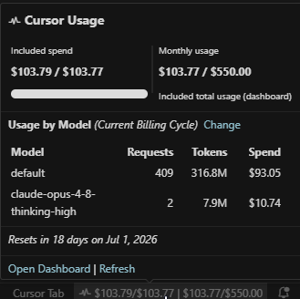
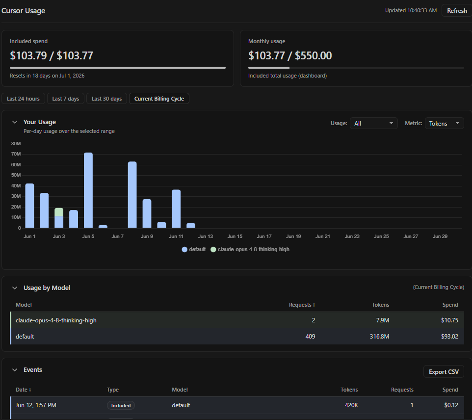

# Cursor Usage

See your **individual** Cursor usage within a **Team subscription** in your status bar: included requests and on-demand spend, live while you work. Click the status bar item to open a full dashboard inside your editor.

Note: this extension targets Cursor **Team** billing/usage (individual usage within the team plan). If you're on an **individual** subscription, the underlying usage endpoints may not match what this extension expects.

## What you get

- Compact status bar display (for example: `$114.78/$300`).
- Detailed hover tooltip with progress bars, reset countdown, and per-model usage.
- Full dashboard tab with summary cards, a per-day stacked bar chart, a sortable Usage by Model table, and a per-event Events table with Export CSV.
- Loading indicator while fresh usage data is being fetched.
- Smart refresh behavior tied to editor activity and window focus.
- Optional minimal mode to show only the active metric.

## Commands

- `Cursor Usage: Open Dashboard` - open the in-editor dashboard.
- `Cursor Usage: Show Details` - show a quick usage summary message.
- `Cursor Usage: Refresh` - force a refresh immediately.

## Settings

- `cursorUsage.pollInterval` (default: `5`) - minimum refresh cooldown in minutes (`1`, `5`, `10`, `30`, `60`).
- `cursorUsage.minimalMode` (default: `false`) - show only the active metric.
- `cursorUsage.usageDuration` (default: `billingCycle`) - tooltip model-usage range: `1d`, `7d`, `30d`, or `billingCycle`.
- `cursorUsage.modelBreakdownSortBy` (default: `tokens`) - sort column for the Usage by Model table (`model`, `requests`, `tokens`, `spend`).
- `cursorUsage.modelBreakdownSortOrder` (default: `desc`) - sort direction for the Usage by Model table (`asc`, `desc`).
- `cursorUsage.excludeZeroTokenModels` (default: `false`) - hide rows where token usage is zero.
- `cursorUsage.quotaAwareEventDisplay` (default: `true`) - in the dashboard, show included usage as requests and on-demand usage as spend (instead of raw request/spend values for every event).

## Privacy and behavior

- No manual API key setup required.
- Uses your existing signed-in Cursor session locally.
- Fetches on activity (editing/focus) instead of constant polling.
- Caches auth and API responses to avoid redundant requests.

## License

MIT
