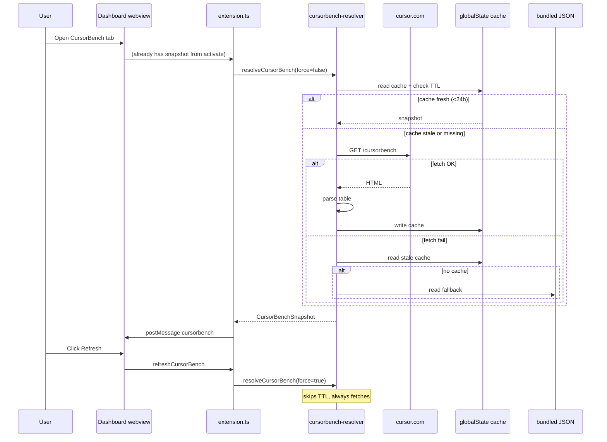

## Goal Capsule

**Objective:** Restore parity between the in-editor CursorBench tab (native chart + table) and [cursor.com/cursorbench](https://cursor.com/cursorbench), and keep it current without manual extension releases.

**Authority:** This plan's Product Contract defines *what*; Implementation Units define *how*. Where they conflict, Product Contract wins.

**Stop conditions:** Done when the dashboard shows CursorBench 3.2 data (or newer), refreshes automatically once per day, supports manual refresh, and degrades gracefully offline.

---

## Product Contract

### Summary

The CursorBench tab currently renders a **static bundled snapshot** (`cursorbench-3.1.json`, captured 2026-06-15). The official page is **CursorBench 3.2** with 60 models vs our 28. There is no network fetch or cache — data only changes when a maintainer hand-edits JSON and publishes a new extension version.

Per user direction: keep the **native** chart/table UI (not iframe embed), fetch live data from cursor.com, **cache for 24 hours**, and expose a **Refresh** control to force-update.

### Requirements

- R1. The CursorBench dashboard tab must display leaderboard data consistent with cursor.com/cursorbench (model names, scores, cost/tokens/steps per task).
- R2. Data must refresh automatically when the cache is older than 24 hours (checked on extension activate and when the dashboard opens).
- R3. The user must be able to force-refresh CursorBench data via a Refresh control in the CursorBench tab header.
- R4. When network fetch fails, the extension must fall back to the most recent successful cache, then to the bundled snapshot — never a blank tab.
- R5. The status-bar tooltip mini-plot must use the same resolved snapshot as the dashboard (single source of truth).
- R6. The UI must indicate data provenance: version, capture timestamp, and whether data is live-cached vs bundled fallback.

### Scope Boundaries

**In scope**

- Fetch + parse cursor.com/cursorbench HTML leaderboard table
- 24-hour TTL cache in extension `globalState`
- Manual refresh button + optional command
- Update bundled fallback snapshot to 3.2
- Parser unit tests with fixture HTML
- Dynamic chart axis scaling for larger datasets

**Deferred to Follow-Up Work**

- Maintainer script to regenerate bundled JSON offline (nice-to-have; fetch-at-runtime covers day-to-day sync)
- Live iframe embed tab (`feat/cursorbench-embed-attempt` approach — explicitly rejected by user)
- Changelog section from official page

**Out of scope**

- Writing scores back to cursor.com
- Model-picker or usage-comparison features beyond existing chart/table

### Key Decisions

- **Native display over iframe** — User chose native chart/table; iframe branch stays unmerged.
- **HTML table parsing over JS chunk scraping** — The SSR `<table>` is stable across deploys; Next.js chunk hashes rotate and are brittle.
- **globalState cache over workspace file** — Matches extension-local, per-user caching; no repo writes at runtime.

---

## Planning Contract

### Key Technical Decisions

**KTD1. Three-tier resolution: cache → network → bundled** (session-settled: user-directed — chosen over iframe-only live view: user wants native UI with daily cache)

Load order on each resolve:

1. If `globalState` cache exists and `capturedAt` is within 24h → use cache.
2. Else attempt `fetch("https://cursor.com/cursorbench")`, parse table, persist to `globalState`.
3. On fetch/parse failure → use stale cache if any, else read bundled `media/cursorbench/cursorbench-latest.json`.

**KTD2. Parse SSR HTML table, not `__NEXT_DATA__` or JS chunks**

The page is Next.js App Router with no public JSON API. The full 60-row leaderboard is server-rendered in `<table class="w-full table-fixed border-collapse">`. Scores on the page are percentages (`73.4%`) and must be stored as fractions (`0.734`) to match existing `CursorBenchRow.score` consumers.

**KTD3. Cache shape mirrors bundled snapshot**

```text
CursorBenchSnapshot {
  version: string      // e.g. "3.2" extracted from page heading
  capturedAt: string // ISO date
  sourceUrl: string    // "https://cursor.com/cursorbench"
  rows: CursorBenchRow[]
  provenance: "live" | "cache" | "bundled"  // new field for UI labeling
}
```

**KTD4. Refresh is async with in-tab loading state**

Dashboard Refresh posts a message to extension host → `refreshCursorBenchSnapshot({ force: true })` → re-posts snapshot to webview. Button disabled + meta shows "Refreshing…" during fetch.

**KTD5. Rename bundled file to version-agnostic name**

Replace hardcoded `cursorbench-3.1.json` with `cursorbench-latest.json` (content = 3.2). Loader no longer encodes version in filename — version lives in JSON `version` field.

### Assumptions

- cursor.com HTML table structure remains broadly stable (class names or column order may shift — parser tests + defensive validation mitigate).
- Extension host `fetch` to cursor.com continues to work without auth (verified: no cookies required, CORS irrelevant in Node).
- 60 rows fits existing table/chart UI without pagination (scroll already present via `.table-scroll`).

### High-Level Technical Design



---

## Implementation Units

### U1. HTML table parser module

**Goal:** Pure function that converts cursor.com HTML into `CursorBenchRow[]`.

**Requirements:** R1

**Dependencies:** None

**Files:**

- Create `src/cursorbench-parse.ts`
- Create `test/fixtures/cursorbench-3.2-table.html` (trimmed fixture with 3–5 representative rows + header)
- Create `test/cursorbench-parse.spec.ts`

**Approach:**

1. Export `parseCursorBenchHtml(html: string): { version: string; rows: CursorBenchRow[] }`.
2. Extract version from text matching `CursorBench (\d+\.\d+)`.
3. Locate leaderboard `<table>` (prefer class `w-full table-fixed border-collapse`, fallback to first table with Score/Cost headers).
4. Skip header row; map columns to model, score (% → fraction), cost ($), tokens (strip commas), steps.
5. Filter rows failing numeric validation (reuse validation rules from `cursorbench-data.ts`).

**Patterns to follow:** `src/cursor-api.ts` helper style (`toNumber`, defensive parsing).

**Test scenarios:**

- Parses fixture HTML into expected row count and field values.
- Converts `73.4%` → `score: 0.734`.
- Strips `$` and commas from cost/tokens.
- Returns empty rows + throws or returns error when table missing.
- Ignores malformed rows without crashing.

**Verification:** `bun test test/cursorbench-parse.spec.ts` passes.

---

### U2. Snapshot resolver with 24h cache

**Goal:** Central resolver implementing KTD1 three-tier load with `globalState` persistence.

**Requirements:** R1, R2, R4

**Dependencies:** U1

**Files:**

- Create `src/cursorbench-resolver.ts`
- Modify `src/cursorbench-data.ts` (types + bundled loader)
- Create `test/cursorbench-resolver.spec.ts`

**Approach:**

1. Add `provenance` to `CursorBenchSnapshot` type.
2. Export `CACHE_TTL_MS = 24 * 60 * 60 * 1000`.
3. Export `resolveCursorBenchSnapshot(ctx, { force?: boolean })`:
   - Read `globalState` key `cursorbench.cache`.
   - If `!force` and cache fresh → return with `provenance: "cache"`.
   - Else fetch + parse; on success write cache, return `provenance: "live"`.
   - On failure return stale cache (`provenance: "cache"`, note stale in meta) or bundled (`provenance: "bundled"`).
4. Rename bundled asset to `media/cursorbench/cursorbench-latest.json`; update `loadBundledCursorBenchSnapshot`.
5. Delete or keep `cursorbench-3.1.json` only if replaced — do not ship both.

**Test scenarios:**

- Fresh cache (<24h) returned without network call (mock fetch).
- Stale cache triggers fetch; successful fetch updates globalState.
- Fetch failure returns stale cache when available.
- Fetch failure with no cache returns bundled snapshot.
- `force: true` bypasses TTL even when cache is fresh.

**Verification:** Resolver tests pass; manual smoke shows `provenance` field set correctly.

---

### U3. Wire resolver into extension lifecycle

**Goal:** Replace static load at activate with resolver; share snapshot across tooltip and dashboard.

**Requirements:** R2, R5

**Dependencies:** U2

**Files:**

- Modify `src/extension.ts`
- Modify `src/cursorbench-data.ts` (re-export resolver entry point if cleaner)

**Approach:**

1. Replace `loadCursorBenchSnapshot(extensionUri)` call with `resolveCursorBenchSnapshot(context, { force: false })`.
2. On dashboard open (`openDashboard` command), re-resolve if cache stale (resolver handles TTL internally).
3. Register `cursor-usage.refreshCursorBench` command (used by dashboard message handler).
4. Keep best-effort pattern: log failures, omit CursorBench UI only if all tiers fail.

**Test scenarios:**

- Activate loads snapshot without throwing when network mocked success.
- Activate succeeds with bundled fallback when network mocked failure.

**Verification:** Extension activates; status bar tooltip shows CursorBench link when data resolves.

---

### U4. Dashboard Refresh button and provenance UI

**Goal:** Manual refresh control and clear data-age labeling.

**Requirements:** R3, R6

**Dependencies:** U3

**Files:**

- Modify `src/dashboard-panel.ts`
- Modify `media/dashboard/dashboard.js`
- Modify `media/dashboard/dashboard.css` (minor: refresh button spacing if needed)

**Approach:**

1. Add `<button id="cursorbench-refresh" type="button">Refresh</button>` next to Open Source.
2. Webview posts `{ type: "refreshCursorBench" }` on click; extension resolves with `force: true` and re-posts snapshot.
3. Update subtitle from "Snapshot of cursor.com/cursorbench" → "From cursor.com/cursorbench" (data may be live).
4. Meta line format: `v3.2 • 2026-09-04 • cached` / `live` / `bundled fallback` based on `provenance` and `capturedAt`.
5. Disable Refresh + show "Refreshing…" until new snapshot arrives.

**Patterns to follow:** Existing dashboard message pattern (`postMessage` / `onDidReceiveMessage` in `dashboard-panel.ts`).

**Test scenarios:**

- Click Refresh triggers host fetch and table re-render (manual).
- Meta text reflects provenance after load.

**Verification:** Manual test in Extension Development Host.

---

### U5. Update bundled fallback to CursorBench 3.2

**Goal:** Offline fallback matches current official leaderboard.

**Requirements:** R1, R4

**Dependencies:** U1 (parser can validate against live fetch output)

**Files:**

- Create `media/cursorbench/cursorbench-latest.json` (60 rows, version 3.2, capturedAt 2026-09-04)
- Remove `media/cursorbench/cursorbench-3.1.json`

**Approach:**

1. Generate JSON by running parser against live page once during implementation (or hand-transcribe from official table).
2. Validate row count ≥ 60 and top model is "Fable 5.1 Max" at ~0.734 score.

**Test expectation:** none — data file only; parser tests in U1 cover format.

**Verification:** With network disabled, dashboard still shows 3.2 models from bundle.

---

### U6. Dynamic chart axis scaling

**Goal:** Chart and tooltip mini-plot accommodate 3.2 score/cost ranges.

**Requirements:** R1

**Dependencies:** U5 (real data shape)

**Files:**

- Modify `media/dashboard/dashboard.js` (`renderCursorBenchChart`)
- Modify `src/cursorbench-tooltip.ts` (hardcoded `ymin=0.30`, `ymax=0.75`, fixed x ticks)

**Approach:**

1. Compute xmin/xmax/ymin/ymax from data with padding (e.g. score floor `max(0, min-0.05)`, ceiling `min(1, max+0.02)`).
2. Generate tick labels from computed ranges instead of fixed `[0.35…0.75]` and `[0,2,4,8…]`.
3. Keep descending-x convention (higher cost on left) unchanged.

**Test scenarios:**

- Chart renders without clipped points for 3.2 top score (~0.734) and max cost (~$17.32).
- Tooltip SVG renders with 60 points without overflow.

**Verification:** Visual check in dashboard + tooltip with 3.2 data.

---

## Verification Contract

```bash
bun test test/cursorbench-parse.spec.ts test/cursorbench-resolver.spec.ts
bun test   # full suite — no regressions
bun run build
```

Manual smoke (Extension Development Host):

1. Open dashboard → CursorBench tab shows v3.2, ~60 models, Fable 5.1 Max at top.
2. Meta shows `live` or `cached` with today's date.
3. Click Refresh → data reloads, meta updates.
4. Disconnect network, clear globalState → bundled fallback loads, meta shows `bundled fallback`.

---

## Definition of Done

- [ ] Dashboard and tooltip show CursorBench 3.2 data (or newer after refresh)
- [ ] Cache TTL is 24 hours; stale cache triggers background fetch
- [ ] Refresh button forces immediate fetch
- [ ] Offline/fetch-failure degrades to cache then bundle without crash
- [ ] Parser and resolver tests pass
- [ ] `CHANGELOG.md` entry under Unreleased
- [ ] Bundled `cursorbench-3.1.json` removed; `cursorbench-latest.json` ships 3.2

---

## Risks & Dependencies

| Risk | Mitigation |
|------|------------|
| cursor.com changes table HTML structure | Fixture-based parser tests fail in CI; fallback to bundled snapshot |
| CDN serves stale HTML | `force` refresh bypasses cache; user sees `capturedAt` |
| globalState size (~60 rows JSON ≈ few KB) | Well within VS Code limits |
| Official page blocks extension User-Agent | Use descriptive UA string; fall back to bundle |

---

## Sources & Research

- Official page: [cursor.com/cursorbench](https://cursor.com/cursorbench) — CursorBench 3.2, 60 models (Sep 2026)
- Repo snapshot: `media/cursorbench/cursorbench-3.1.json` — version 3.1, 28 models, captured 2026-06-15
- Loader: `src/cursorbench-data.ts` — hardcoded path, no network
- Rejected approach: `feat/cursorbench-embed-attempt` — iframe embed (user wants native UI)
- External research: no public JSON API; SSR HTML table is the stable parse target
